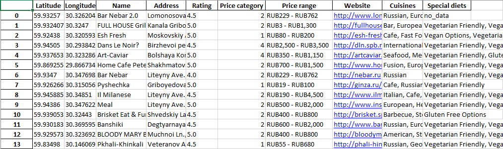

# 
St.Petersburg's restaurants data analyzing

## Data overview

While running the script, data from 86 pages were collected. Each page is stored in a separate Excel file with around ~35 rows of data.

Example of collected data.

## Pricing

Having the price range of restaurants we can have a quick look on the amount of restaurants in several price categories:

Vast majority of restaurants offers prices from RUB0-500 ($0-6.5) to RUB500-1000 ($6.5-13) and RUB1000-2000($13-26)

## Cuisines

Having the diets and cuisines data, lets find out which categories are the most popular in St.Petersburg:

Most popular diets and cuisine categories.

Restaurants in St.Petersburg are vegeratian-friendly. Also, the most popular food cuisines are european and russian.

## Ratings

Restaurants categorized by its rating.

The scatterplot gives us a good view about density and ratings. in central districts such as Petrogradsky, Vasilievsky and Admiralteysky and Central district. In peripheries restaurants are located alonogside the main roads.

Note: Tripadvisor is a web-service mostly made for tourists. Restaurants and clubs in peripheries might be not presented on Tripadvisor.
